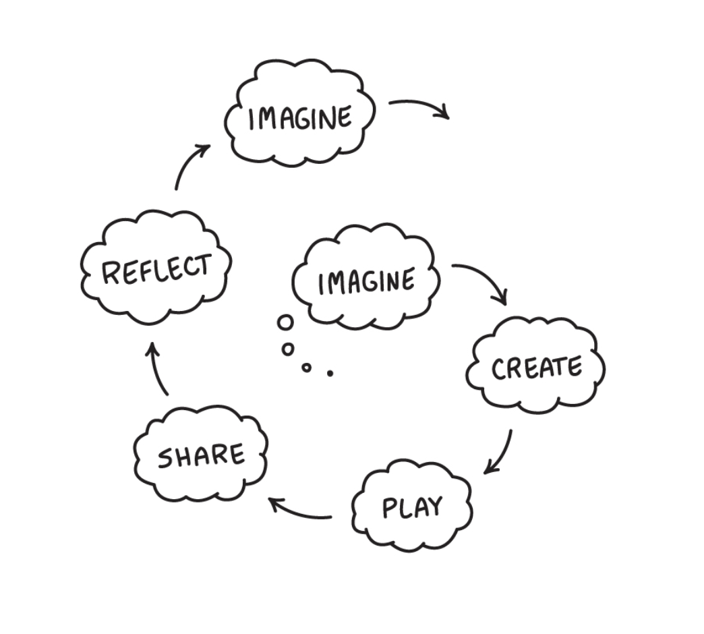

Imagine working on a task. There is a standard process to follow. You have done this severally that you now call yourself an expert. You get comfortable. You stop thinking. Nonetheless, you perform as expected and the outcome is good enough. Let's call this *L1 scenario*.

Now imagine working on a project. You are willing to take risks and try new things. You are not comfortable---constantly exploring, experimenting and testing. You come up with the most innovative and creative outcome. This is *L2 scenario*.

The world is volatile. The workplace is volatile. Business is volatile. Life is unpredictable. Change is constant. A disruption fueled by rapid evolution in technologies and AI, demands for creative thinkers—--people who can discover creative and new ways of working, allowing them to adapt to uncertainty and change. The future of the universe rests on their shoulders.
 
To think creatively you have to constantly learn, un-learn and re-learn---in creative ways. 

In his book, *Lifelong Kindergarten*, Mitchel Resnik advocates for kindergarten-style approach to learning. "I’m convinced that kindergarten-style learning is exactly what’s needed to help people of all ages develop the creative capacities needed to thrive in today’s rapidly changing society.", he writes. 

He explains the interactive creative learning process kindergarten children experience when building---say---a tower, using blocks. First, they imagine a fantasy tower. Then they start building the tower. Then they constantly toy with and experiment with different heights and designs (the tower sometimes collapse). They collaborate and share ideas as they build. When the tower collapses they reflect and rebuild it based on the new information they just discovered. Finally, based on these experiences, they imagine even more ideas to improve their new creation.

Resnik calls this process the Creative Learning Spiral. In this process, learners "...develop their own ideas, try them out, experiment with alternatives, get input from others, and generate new ideas based on their experiences."

But why this approach? 

Creative learning is learning to think and create through enjoyful experimentation, exploration and collaboration on topics of interest (or projects). It develops creative thinkers. 

I believe our education systems and businesses must encourage this approach to learning.

The formal education system is in a mess---designed to systemically produce *L1 scenarios*. There is no room for students to question content they consume, they are made to work on boring assignments and study only to pass exams. This must change if we want to build a society of creative thinkers and innovative leaders. There is an urgent need to incorporate learning methods that encourage creativity and innovation---like introducing project-based activities early. Interventions need to start at the grassroots, with solid systems put in place to entrench a creative learning culture.

At [Gazelle Infotech Africa](https://gazelle.africa) we partner with schools and parents to teach young people creative digital skills through computer science education---helping them build practical coding and logical problem-solving skills in a fun, age-appropriate way---using project-based learning. 

The kindergarten-style approach to learning is akin to agility. Businesses that adopt agile frameworks---like SCRUM---founded on strong principles that encourage experimentation, continuous improvement and delivery, collaboration and adaptation inspire creative thinkers and innovators in their teams.

### Additional Reading & References
1. [Lifelong Kindergarten](https://mitpress.mit.edu/9780262536134/lifelong-kindergarten/)
2. [Learning Creating Learning](https://lcl.media.mit.edu)
3. [Learning Through Play](https://learningthroughplay.com)
4. [What is SCRUM: A Guide to the Most Popular Agile Framework](https://www.scrumalliance.org/about-scrum)

